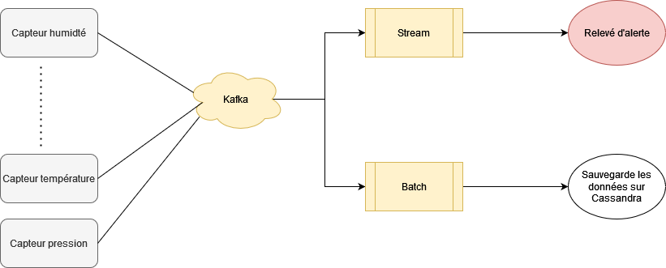

# MLOPS

Sujet numéro 8 : génération et récolte de données avec Kafka

## Détails du projet

Dans une raffinerie, il y a des milliers de capteurs qui envoient des données toutes les minutes.
Ainsi s'il y a une erreur, elle est très vite détecté.
Cependant, il doit aussi toujours il doit y avoir un suivi des logs de tous les capteurs pour en suivre leurs dysfonctionnements.

C'est pourquoi nous allons utiliser une architecture lambda dans ce projet. 

Une partie des données considérer comme critique doivent être envoyé au plus vite aux techniciens.
Et un autre partie doit stocker tous les logs.

Et pour finir il y aura une partie qui va permettre de faire des statistiques sur les données.

Les messages seront générés aléatoirement.

## Technologies utilisées (TODO)
- Kafka
- Spark (PySpark)
- Cassandra
- Grafana

## Schéma de l'architecture

## Authors :

- Guillaume Larue
- Nicolas Trabet